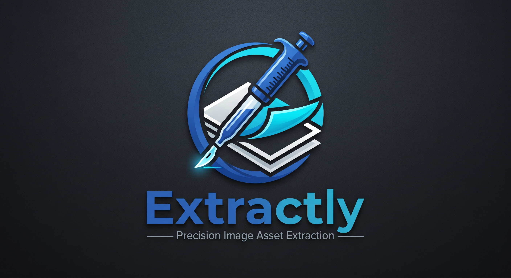

# Extractly

**Precision asset extraction from flat-colour images — no AI, no server, no signup.**



🔗 **[Try it live → rilhia.github.io/extractly](https://rilhia.github.io/extractly/)**

---

## Why I Built This

I'm building a [Home Assistant](https://www.home-assistant.io/) floorplan card generator. A tool that lets you turn a property floorplan into a fully interactive dashboard, complete with room-level lighting controls and energy monitoring.

The problem I kept running into was *source material*. Property floorplans from sites like [Zoopla](https://www.zoopla.co.uk/) and [Rightmove](https://www.rightmove.co.uk/) are the most readily available floor plans most people have access to, but they come loaded with agent branding, room labels, scale bars, and white backgrounds. None of which you want in a dashboard asset.

I needed a way to:
- Strip out unwanted text and branding
- Remove the background cleanly to leave it transparent
- Export individual rooms or the whole plan as transparent PNGs

Every existing tool I looked at either required uploading to a server, used AI background removal that struggled with architectural line drawings, or cost money. So I built the code for Extractly.

Once it was working well I realised it was useful beyond just floorplans. Logos, icons, diagrams, and any flat-colour image can be processed through the same pipeline. So I'm releasing it as a standalone tool.

---

## What It Is

Extractly is a **single-page web application** that runs entirely in your browser. There is no server, no data upload, no account, and no cost. Your images never leave your device.

It uses **rule-based colour mathematics** — not AI or machine learning. This means:

- It works **exceptionally well** on images with clearly defined, solid-colour regions: floorplans, diagrams, logos, icons, architectural drawings
- It works **with some effort** on photographic images with complex backgrounds, which may need multiple passes through the steps
- It is **deterministic** — the same input with the same settings always produces the same output

---

## Features

- **6-step guided wizard** — each step has a clear, focused purpose
- **Background removal** — global colour removal or contiguous flood fill with adjustable tolerance
- **Content redaction** — paint over unwanted text, logos, or labels before removal
- **Colour cleanup** — protect specific colours and erase everything else
- **Blemish eraser** — draw boxes to remove artefacts and noise
- **Flexible export** — free-draw crop, fixed aspect ratios (1:1, 4:3, 16:9), or bespoke pixel dimensions
- **Zoom & pan** — works at any zoom level; right-click drag on desktop, two-finger drag or pan mode toggle on touch
- **Full touch support** — pinch to zoom, tap to interact, floating pan/zoom controls for mobile
- **Works offline** — no dependencies on external services; runs from a local folder or any static web host

---

## Browser Compatibility

| Browser | Desktop | Mobile |
|---|---|---|
| Chrome / Edge | ✅ | ✅ |
| Firefox | ✅ | ✅ |
| Safari | ✅ | ✅ (iOS 15+) |

Requires a browser with Canvas API and `createImageData` support — all modern browsers qualify.

---

## Getting Started

Extractly requires no build step, no package manager, and no server. You can use the [live version](https://rilhia.github.io/extractly/) directly, or run it locally.

### Option 1 — Run locally

```bash
git clone https://github.com/rilhia/extractly.git
cd extractly
```

Then open `index.html` directly in your browser, or serve it with any static file server:

```bash
# Python (built into macOS/Linux)
python3 -m http.server 8080

# Node (if you have npx)
npx serve .
```

### Option 2 — Deploy to a static host

Drop the three files (`index.html`, `style.css`, `script.js`) and the `images/` folder onto any static host — GitHub Pages, Netlify, Cloudflare Pages, or your own web server.

---

## How to Use

Extractly walks you through six steps in sequence. You can move **Back** and **Forward** between steps at any time — each step saves a snapshot of the image state, so going back restores exactly where you were.

---

### Step 1 — Load Your Image

Click **Load Image** and select your source file. PNG and JPEG are both supported; PNG is preferred if you have the choice, as it avoids JPEG compression artefacts around edges.

**For floorplans:** if your plan is inside a PDF, take a screenshot or use a PDF-to-image tool to export it first. The higher the resolution, the more precise the extraction — aim for at least 1000px wide.

Once loaded, the image appears on the canvas. Use the **Zoom slider** or **+ / −** buttons to adjust your view. On desktop, **right-click and drag** to pan. On touch devices, use **two-finger drag** to pan or tap the **✥ pan button** to switch to single-finger pan mode.

---

### Step 2 — Remove Unwanted Content

Use this step to cover up anything you don't want in the final image *before* background removal — agent branding, room dimensions, north arrows, scale bars, or any other visual noise.

**How it works:**

1. **Click anywhere on the background** of your image to sample its colour. A colour swatch appears — confirm it looks right and click **Confirm Background**.
2. **Draw boxes** over any content you want to remove. Each box is filled with the sampled background colour, making the content disappear seamlessly.
3. Use **Undo** to remove the last box if you overshoot.

> **Why do this before Step 3?** Once the content is painted over with the background colour, it will be removed along with the background in the next step — you end up with clean transparency where the text used to be, rather than a white rectangle.

---

### Step 3 — Remove the Background

Make the background transparent.

1. **Click anywhere on the background colour** you want to remove. The sampled colour is shown as a swatch.
2. **Drag the Tolerance slider** slowly to the right to expand how many similar shades are removed. The effect previews live as you drag.
3. **Click the image again** to pick a different starting colour and start fresh — useful for backgrounds that aren't perfectly uniform.

**Contiguous mode (Flood Fill checkbox ON):**
Only removes pixels that are *connected* to the point you clicked. This is the safest option — ideal for a clean white background that doesn't appear inside the image area.

**Global mode (Flood Fill checkbox OFF):**
Removes the selected colour everywhere in the image, regardless of position. Use this when the background appears in patches that aren't connected to each other.

> **Tip:** Keep the tolerance as low as you can get away with. A high tolerance on a floorplan will start eating into wall lines and room fill colours. If residual fringe pixels remain, Step 4 is designed to clean those up.

---

### Step 4 — Colour Cleanup

Fine-tune the result after background removal. This step lets you define which colours to *keep*, then erase everything else.

**Building your protected palette:**

1. **Click each colour you want to preserve** — wall lines, room fills, furniture, staircase hatching. Each click adds a swatch to the Protected Palette at the top.
2. Build up as many colours as you need. **Undo** removes the last palette entry if you make a mistake.

**Running the cleanup:**

3. Select a **replacement colour** using the colour picker. This is what unprotected pixels will be converted to — usually white or a bright colour you can easily remove in a follow-up pass through Step 3.
4. Click **Enable Cleanup Slider** when your palette is complete.
5. **Slowly drag the Tolerance slider**. Pixels that don't match any protected colour will be converted to the replacement colour. This is particularly effective at clearing fringe pixels and anti-aliasing noise that survived Step 3.

> **Tip for floorplans:** Protect wall colours first (typically black or dark grey), then room fill colours, then any feature colours such as wet rooms or staircases. If you accidentally remove something, Undo restores the previous state.

---

### Step 5 — Blemish Removal

A precision eraser for anything that survived the previous steps.

**Draw boxes** around artefacts — spots, stray lines, leftover text fragments, scan noise, or JPEG compression blobs — and they are made fully transparent.

- **Zoom in** (slider or **+** button) to work precisely on small areas
- On touch: tap **✥** to switch to pan mode so you can navigate the zoomed image without accidentally drawing boxes; tap again to switch back to erase mode
- **Undo** restores the last erased area

---

### Step 6 — Export Your Asset

Crop and download the finished results as transparent PNGs. You can export any part of the processed image as its own file — as many times as you like.

**Choosing your crop:**

| Option | How it works |
|---|---|
| **Free Draw** | Click and drag directly on the image to define any region |
| **Square / Standard / Wide** | Locks to a 1:1, 4:3, or 16:9 aspect ratio as you draw |
| **Bespoke** | Enter a custom aspect ratio; the crop box maintains it as you draw |
| **Fixed pixel size** | Enter width and height in the Size fields; a fixed-size box follows your cursor — click to place it, then drag to reposition |

Click **↓ Download** to save the selected region as `Extractly_Export.png`.

**You can make as many exports as you like** from the same processed image — reposition the crop box and download again. Each export is independent.

When you're done, click **New File** to start over.

---

## Controls Reference

### Desktop

| Action | Input |
|---|---|
| Interact (draw, pick colour, place crop) | Left click / drag |
| Pan the canvas | Right-click drag |
| Zoom | Zoom slider in toolbar |

### Touch

| Action | Gesture |
|---|---|
| Interact (draw, pick colour, place crop) | Single finger tap / drag |
| Pan the canvas | Two-finger drag, or enable **✥ pan mode** then single finger |
| Zoom | Pinch, or use **+** / **−** buttons |
| Pan mode toggle | **✥** button (floating, bottom-right of canvas) |

---

## Project Structure

```
extractly/
├── index.html      # Application markup
├── style.css       # Responsive layout and theming
├── script.js       # All application logic
└── images/
    ├── ExtractlyIcon.png
    ├── ExtractlyText.png
    └── ExtractlyLogoReadme.png
```

No build tools, no dependencies, no `node_modules`. It's just files.

---

## Limitations

- **Not AI** — Extractly cannot intelligently separate subjects from complex photographic backgrounds the way a machine-learning tool can. If your image has a gradient background, blurred edges, or similar foreground and background colours, results will vary.
- **Canvas size** — very large images (above ~6000×6000px) may be slow on lower-powered devices, particularly during flood fill operations, which are CPU-bound.
- **JPEG artefacts** — JPEG compression creates bands of slightly different colour around edges. Increasing tolerance to compensate can bleed into nearby colours. Sourcing or exporting your image as PNG where possible avoids this entirely.

---

## Roadmap / Ideas

These are things I may add depending on how useful this turns out to be for others:

- [ ] Magic wand selection (click-to-select contiguous region, then choose what to do with it)
- [ ] Edge feathering / anti-aliasing control on export
- [ ] Multi-image batch mode
- [ ] Direct integration with the Home Assistant floorplan card generator (the tool this was originally built for)

---

## Licence

MIT — do what you like with it.

---

## Contributing

Issues and pull requests are welcome. If you're using this for something other than floorplans I'd be genuinely curious to hear about it.
